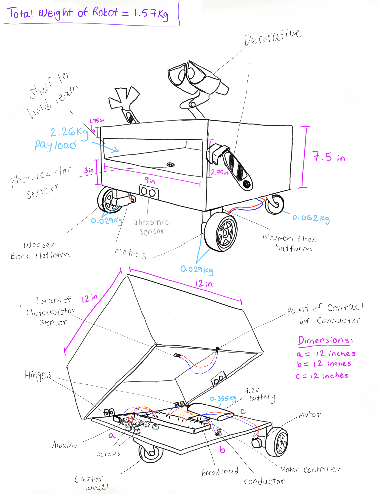

# Autonomous Line-following Robot
In my Intro to Engineering course, we were tasked with a semester long team project to build an autonomous line-following robot. The robot was designed to deliver printer paper to the printers on campus to solve the issue of overspending on labor in the IT department. The robot utilized infrared, ultrasonic and photoresistor sensors to steer along a black line, detect obstacles in its path, and determine if a ream of paper had been loaded/unloaded. 

## Parts 
the robot was comprised of: 
* Two servo motors
* A motor controller
* Three wheels, 
* A breadboard
* Rechargeable battery
* On/off button
* Sensors 
* An Arduino as the “brain”

## Sensors
* Ultrasonic – if it detected an obstacle 12-inches away, it would run a loop every second to verify the obstacle is still there and if object is still there after 2 loops, the robot will come to a halt. Based on speed our robot travels in inches per second it will stop 6-8 inches away from obstacle
* IR sensors – used a potentiometer to fine tune sensitivity. Used a binary scale to measure how much light is reflected (so if no light is reflective, it is on the black line, if a lot of light is reflected its on white paper & needs to correct course)
* Photoresistor – placed this at base of paper tray so that it gets covered up when paper is loaded. We hard coded the brightness value of when the printer paper is covering sensor as well as brightness value without paper, and the motors will not start unless the proper brightness value is detected 

## Flowchart
Below is the flowchart that better illustrates the logic behind each component.

## Concept Sketch
Below is the concept sketch with torque and power calculations.
