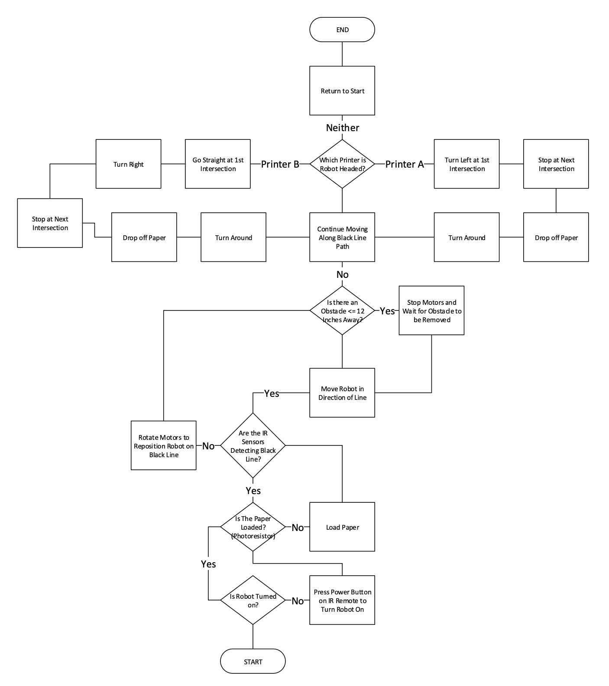

# Autonomous Line-following Robot
In my Intro to Engineering course, we were tasked with a semester long team project to build an autonomous line-following robot. The robot was designed to deliver printer paper to the printers on campus to solve the issue of overspending on labor in the IT department. The robot utilized infrared, ultrasonic and photoresistor sensors to steer along a black line, detect obstacles in its path, and determine if a ream of paper had been loaded/unloaded. 

## Parts 
the robot was comprised of: 
* Two servo motors
* Motor controller
* Three wheels
* Breadboard
* Rechargeable battery
* On/off button
* Sensors 
* An Arduino as the “brain”

## Sensors
* **Ultrasonic** – If it detected an obstacle 12-inches away, it would run a loop every second to verify the obstacle is still there and if the object is still there after 2 loops, the robot will come to a halt. Based on the speed that the robot travels in inches per second (in/s), it will stop 6-8 inches away from obstacle.
* **IR Sensors** – We used a potentiometer to fine tune sensitivity and a binary scale to measure how much light is reflected. So if no light is reflected, this means that the robot is on top of the black line, and if a lot of light is reflected (i.e. a 1 on a scale of 0 or 1), this means the robot is on the white paper & needs to correct its course.
* **Photoresistor** – We placed this at base of paper tray so that it gets covered up when paper is loaded. We hard-coded the brightness value for when the printer paper is covering the sensor, as well as the brightness value without paper, so we could use this variables to tell the motors when to stop and start. The motors will not start unless the proper brightness value is detected because one of the constraints for this project was that the robot remain stationary until the paper is loaded, thus giving a person enough time to load the paper.

## Flowchart
Below is the flowchart that better illustrates the logic behind each component.

## Concept Sketch
Below is the concept sketch with weight and dimensions.
